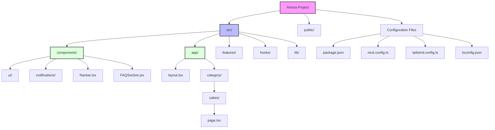

```mermaid
graph TD
    A[Amora Project] --> B[src/]
    A --> C[public/]
    A --> D[Configuration Files]
    
    B --> E[app/]
    B --> F[components/]
    B --> G[features/]
    B --> H[hooks/]
    B --> I[lib/]
    
    F --> J[ui/]
    F --> K[notifications/]
    F --> L[Navbar.tsx]
    F --> M[FAQSection.jsx]
    
    E --> N[layout.tsx]
    E --> O[category/]
    
    O --> P[cakes/]
    P --> Q[page.tsx]
    
    D --> R[package.json]
    D --> S[next.config.ts]
    D --> T[tailwind.config.ts]
    D --> U[tsconfig.json]

    %% Component relationships
    style A fill:#f9f,stroke:#333,stroke-width:2px
    style B fill:#bbf,stroke:#333,stroke-width:2px
    style F fill:#dfd,stroke:#333,stroke-width:2px
    style E fill:#dfd,stroke:#333,stroke-width:2px
```
